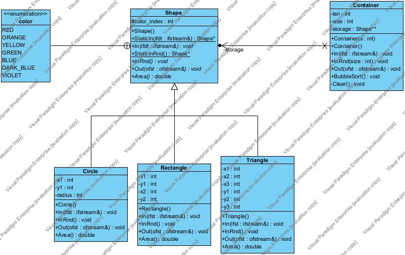

# Задание 2: Статически типизированная архитектура ВС, ориентированная на объектно-ориентированный подход

*Вариант 29 (task: 1, function: 3)*

##  Описание полученного задания

### Обобщенный артефакт, используемый в задании:

- Плоская геометрическая фигура, размещаемые в координатой сетке

### Базовые альтернативы:

- Круг (целочисленные координата центра окружности, радиус)
- Прямоугольник (целочисленные координаты левого верхнего и правого нижнего углов)
- Треугольник (целочисленные координаты трех углов)

### Общие для всех альтернатив переменные:

- Цвет фигуры (перечислим ый тип) = {красный, оранжевый, желтый, зеленый, голубой, синий, фиолетовый}

### Общие для всех альтернатив функции:

- Вычисление площади фигуры(действительное число)

### Дополнительная функия:

- Упорядочить элементы контейнера по возрастанию используя сортировку с помощью прямого обмена или пузырька (Bubble Sort). В качестве ключей для сортировки и других действий используются результаты функции, общей для всех альтернатив.

## Реализация

### Параметры запуска:

- Случайная генерация фигур: `-n <количествово фигур> <файл для вывода 1> <файл для вывода 2>`
- Считывание фигур из файла `-f <файл для ввода> <файл для вывода 1> <файл для вывода 2>`

### Тесты:

- Тесты хранятся в папке *tests* в формате .txt, каждые две строки описывают одну фигуру (её тип и параметры)
- Каждый тест заканчивается нулем
- Результаты тестов хранятся в папке *results*, каждая строка описывает одну фигуру

### Пример теста:

`tests/test_5.txt`

```
1
1 -18 82 -49 7
3
-83 45 55 1
2
96 31 19 -14 63 52 3
2
-5 56 -94 98 76 80 3
3
-96 -27 7 0
0
```

### Пример вывода:

`results/result_5_1.txt`

```
Filled container:
Container contains 5 elements.
1: It is Rectangle: (x1, y1) = (1, -18) (x2, y2)= (82, -49). Color: none. Area = 2511
2: It is circle: (x1, x2) = (-83, 45) with radius = 55. Color: orange. Area = 9503.32
3: It is Triangle: (x1, x2) = (96, 31) (x2, y2) = (19, -14) (x3, y3) = (63, 52). Color: green. Area = 1551
4: It is Triangle: (x1, x2) = (-5, 56) (x2, y2) = (-94, 98) (x3, y3) = (76, 80). Color: green. Area = 2769
5: It is circle: (x1, x2) = (-96, -27) with radius = 7. Color: red. Area = 153.938
```

`results/result_5_2.txt`

```
Sorted container:
Container contains 5 elements.
1: It is circle: (x1, x2) = (-96, -27) with radius = 7. Color: red. Area = 153.938
2: It is Triangle: (x1, x2) = (96, 31) (x2, y2) = (19, -14) (x3, y3) = (63, 52). Color: green. Area = 1551
3: It is Rectangle: (x1, y1) = (1, -18) (x2, y2)= (82, -49). Color: none. Area = 2511
4: It is Triangle: (x1, x2) = (-5, 56) (x2, y2) = (-94, 98) (x3, y3) = (76, 80). Color: green. Area = 2769
5: It is circle: (x1, x2) = (-83, 45) with radius = 55. Color: orange. Area = 9503.32
```

## Структура вычислительной системы

### Отображение содержимого классов



## Тестовые прогоны

### Ввод через файл:

- 5 элементов: 0.0010 сек.
- 100 элементов: 0.0060 сек.
- 1000 эелементов: 0.0180 сек.
- 10000 элементов: 2.3400 сек.

## Вывод

- На больших наборах вводимых данных архитектура ВС, ориентированная на объектно-ориентированный подход,
выполняется быстрее, чем программы в функциональной парадигме

### Характеристики программы:

- Число интерфейсных модулей: 6
- Число модулей реализации: 6