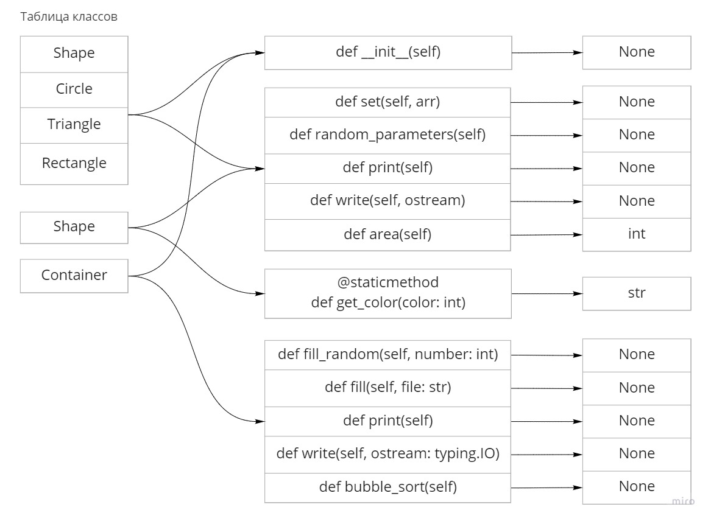
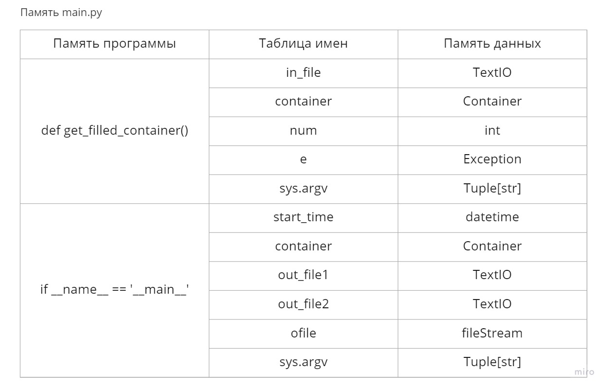
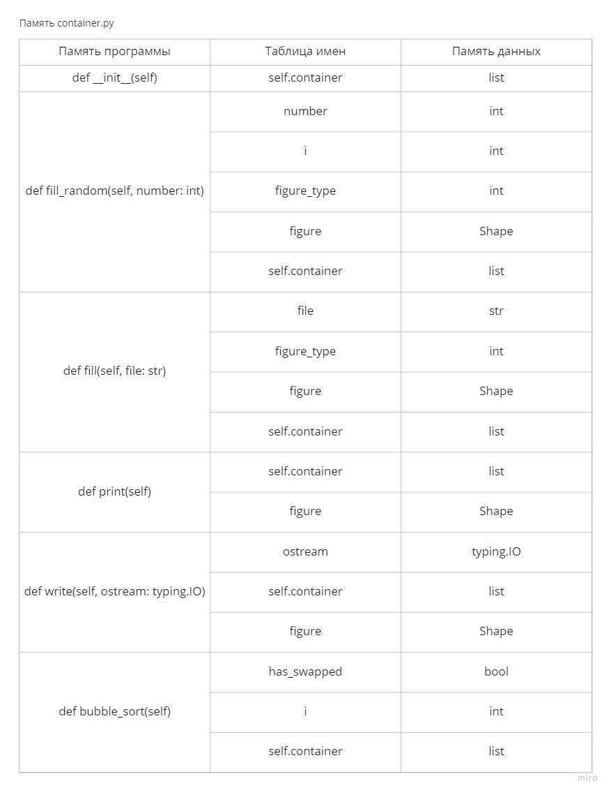
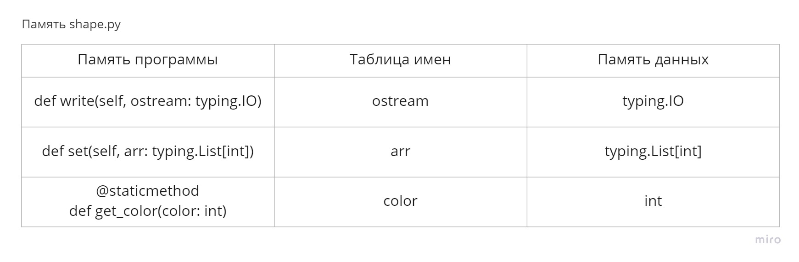
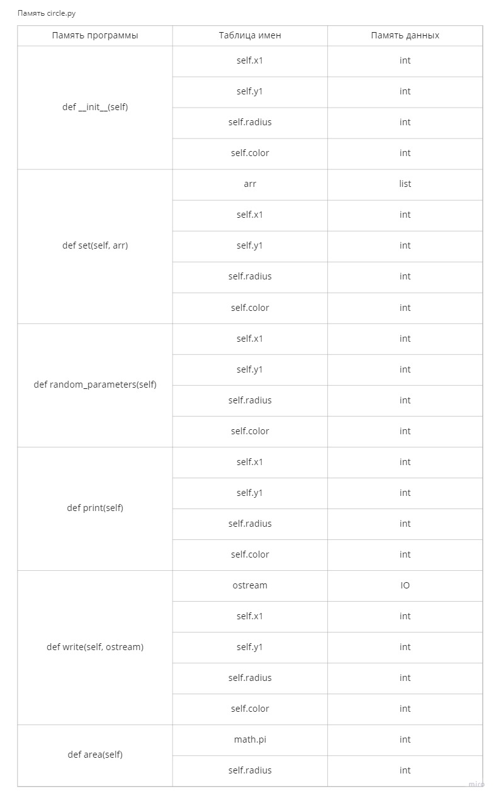
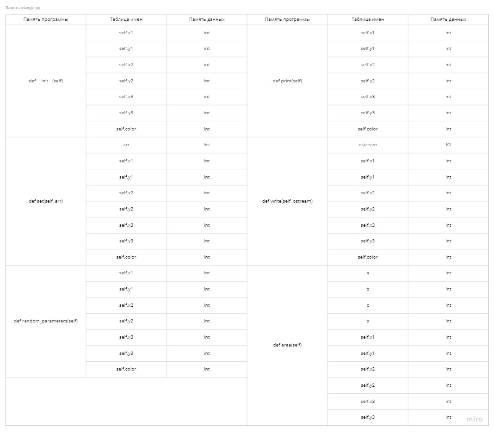
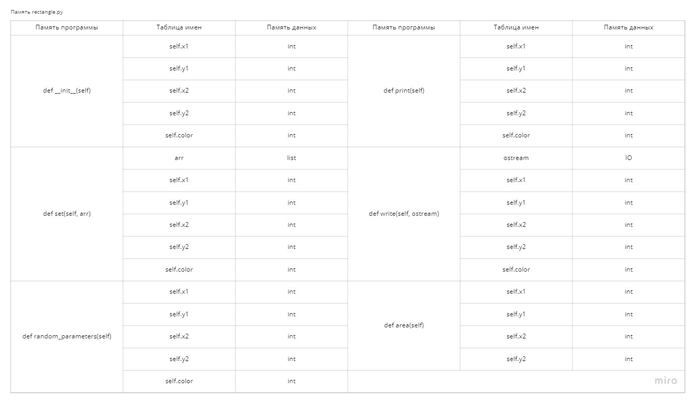
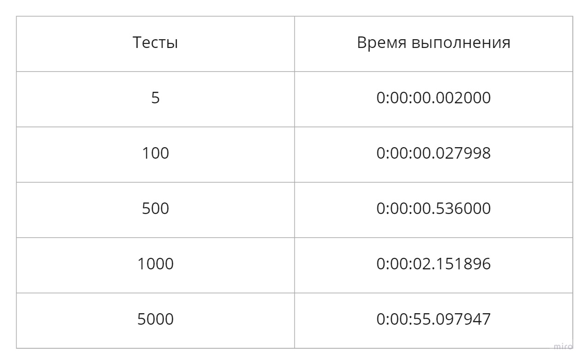

#Задание 3: Архитектура ВС с динамической типизацией

*Вариант 29 (task: 1, function: 3)*

##  Описание полученного задания

###Обобщенный артефакт, используемый в задании:

- Плоская геометрическая фигура, размещаемые в координатой сетке

###Базовые альтернативы: 

- Круг (целочисленные координата центра окружности, радиус)
- Прямоугольник (целочисленные координаты левого верхнего и правого нижнего углов)
- Треугольник (целочисленные координаты трех углов)

###Общие для всех альтернатив переменные:

- Цвет фигуры (перечислим ый тип) = {красный, оранжевый, желтый, зеленый, голубой, синий, фиолетовый}

###Общие для всех альтернатив функции:

- Вычисление площади фигуры(действительное число)

###Дополнительная функия:

- Упорядочить элементы контейнера по возрастанию используя сортировку с помощью прямого обмена или пузырька (Bubble Sort). В качестве ключей для сортировки и других действий используются результаты функции, общей для всех альтернатив.

##Реализация

###Параметры запуска:

- Случайная генерация фигур: `-r <количествово фигур> <файл для вывода 1> <файл для вывода 2>`
- Считывание фигур из файла `-f <файл для ввода> <файл для вывода 1> <файл для вывода 2>`

###Тесты:

- Тесты хранятся в папке *tests* в формате .txt, каждые две строки описывают одну фигуру (её тип и параметры)
- Каждый тест заканчивается нулем
- Результаты тестов хранятся в папке tests_results, каждая строка описывает одну фигуру

###Пример теста:

`tests/test_5.txt`

```
2
-41 -92 26 -21 56 -88 6
1
-23 -2 18 -65 2
3
16 -18 41 3
2
-78 15 55 -6 30 34 5
2
72 73 -19 -61 57 82 2
0
```

###Пример вывода:

`tests/test_5_result.txt`

```
There are 5 objects:
Triangle: (x1, y1) = (-41, -92), (x2, y2) = (26, -21), (x3, y3) = (56, -88), color = dark blue, area = 3309.500000000001
Rectangle: (x1, y1) = (-23, -2), (x2, y2) = (18, -65), color = orange, area = 2583
Circle: center = (16, -18), radius = 41, color = yellow, area = 5281.017250684442
Triangle: (x1, y1) = (-78, 15), (x2, y2) = (55, -6), (x3, y3) = (30, 34), color = blue, area = 2397.5
Triangle: (x1, y1) = (72, 73), (x2, y2) = (-19, -61), (x3, y3) = (57, 82), color = orange, area = 1414.500000000002
```

`tests/test_5_sorted.txt`

```
Sorted container:
There are 5 objects:
Triangle: (x1, y1) = (72, 73), (x2, y2) = (-19, -61), (x3, y3) = (57, 82), color = orange, area = 1414.500000000002
Triangle: (x1, y1) = (-78, 15), (x2, y2) = (55, -6), (x3, y3) = (30, 34), color = blue, area = 2397.5
Rectangle: (x1, y1) = (-23, -2), (x2, y2) = (18, -65), color = orange, area = 2583
Triangle: (x1, y1) = (-41, -92), (x2, y2) = (26, -21), (x3, y3) = (56, -88), color = dark blue, area = 3309.500000000001
Circle: center = (16, -18), radius = 41, color = yellow, area = 5281.017250684442
```

##Структура вычислительной системы

###Отображение содержимого классов



###Отображение на память методов классов













##Заключение

###Тестовые прогоны:



###Характеристики программы:

- Количество файлов в программе: 6

###Вывод:

- Использование динамической типизации приводит к тому, что программа работает в разы медленнее, чем при использовании 
статической типизации
